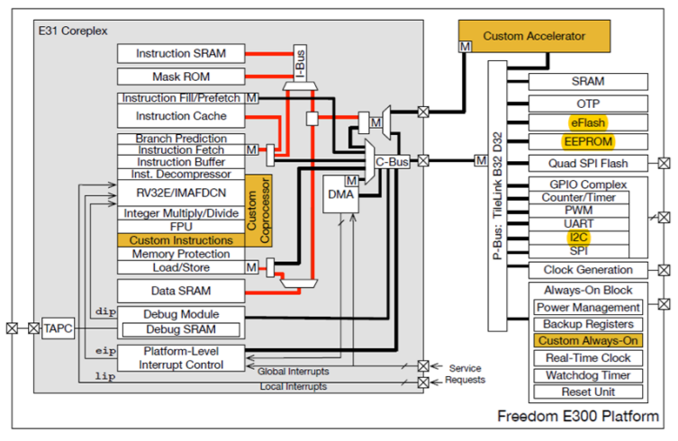
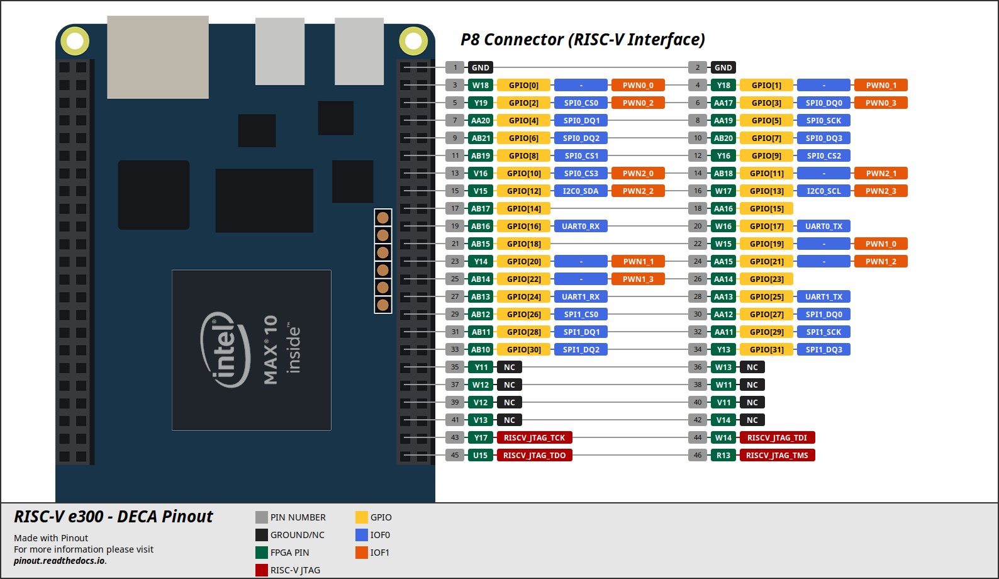

# RISC-V Freedom E300

RISC-V is a free and open Instruction Set Architecture (ISA) enabling a new era of processor innovation through open standard collaboration. Any organization or individual can design their own processor based on the RISC-V architecture. Freedom E300 is a RISC-V core implemented in RTL by SiFive in Scala. For more information and source files visit the [Freedom E300 project page](https://github.com/sifive/freedom).

## About the Project

The original Freedom E300 was implemented in Scala and modified to run on Altera/Intel boards. Since the Verilog code generated by the Scala is hardly readable, the project was encapsulated. The clock, reset, JTAG interface, QSPI interface, GPIO interface (including various peripherals such as UART, I2C, SPI, etc.) are on the top-level port for easy logic operation and pin connection to the FPGA.

## Top-Level Block Diagram

The Freedom E300 which contains an E31 Coreplex, a selection of flexible I/O peripherals, a dedicated off-chip Quad-SPI flash controller with execute-in-place support, On-chip Memory, clock generation, and an always-on (AON) block. In addition, custom accelerator can be added to provide application-specific processing.

## Memory map of Freedom E300

| Base        | Top         | Description                           | Notes                        |
| ----------- | ----------- | ------------------------------------- | ---------------------------- |
| 0x0000_0000 | 0x0FFF_FFF  | refer E3 Coreplex Manual              |                              |
| 0x1000_0000 | 0x1000_7FFF | Always-On (AON)                       | E3 Coreplex                  |
| 0x1000_8000 | 0x1000_FFFF | Power, Reset, Clock, Interrupt (PRCI) | On-Chip Peripherals          |
| 0x1001_0000 | 0x1001_0FFF | On-chip OTP control                   | On-Chip Peripherals          |
| 0x1001_1000 | 0x1001_1FFF | On-chip eFlash control                | On-Chip Peripherals          |
| 0x1001_2000 | 0x1001_2FFF | GPIO0                                 | On-Chip Peripherals          |
| 0x1001_3000 | 0x1001_3FFF | UART0                                 | On-Chip Peripherals          |
| 0x1001_4000 | 0x1001_4FFF | QSPI0                                 | On-Chip Peripherals          |
| 0x1001_5000 | 0x1001_5FFF | PWM0                                  | On-Chip Peripherals          |
| 0x1002_3000 | 0x1002_3FFF | UART1                                 | On-Chip Peripherals          |
| 0x1002_4000 | 0x1002_4FFF | QSPI1                                 | On-Chip Peripherals          |
| 0x1002_5000 | 0x1002_5FFF | PWM1                                  | On-Chip Peripherals          |
| 0x1003_4000 | 0x1003_4FFF | QSPI2                                 | On-Chip Peripherals          |
| 0x1003_5000 | 0x1003_5FFF | PWM2                                  | On-Chip Peripherals          |
| 0x2000_0000 | 0x3FFF_FFFF | QSPI0 XIP                             | Off-Chip Non-Volatile Memory |
| 0x4000_0000 | 0x7FFF_FFFF | Additional I/O or RAM                 | Off-Chip Non-Volatile Memory |
| 0x8000_0000 | 0x8001_FFFF | Instruction and Data RAM              | On-Chip Volatile Memory      |
| 0x8002_0000 | 0xFFFF_FFFF | Additional RAM                        | On-Chip Volatile Memory      |

## Building

### Bitstream

### BSP

#### Toolchain (e-SDK)

TODO

#### Upload core to FPGA

TODO

#### Upload Binary code to QSPI Flash

TODO

## e300 GPIO Pinout

## Credits and acknowledgment

## Legal Notices

This work is licensed under multiple licenses.

All original source code is licensed under the [Apache License Version 2.0] unless implicit indicated.

All documentation is licensed under [Creative Commons Attribution-ShareAlike 4.0 International] Public License.

The authors and contributors or any of its maintainers are in no way associated with or endorsed by Intel®, Terasic®, SiFive® or any other company not implicit indicated.
All other brands or product names are the property of their respective holders.

[Apache License Version 2.0]: https://spdx.org/licenses/Apache-2.0.html
[Creative Commons Attribution-ShareAlike 4.0 International]: https://spdx.org/licenses/CC-BY-SA-4.0.html
